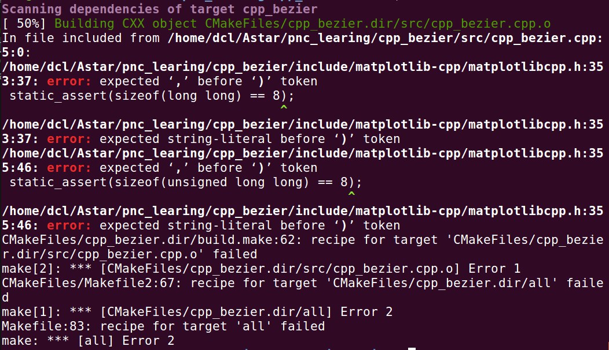

# pnc_learing

1.cpp_bezier: 基于C++的贝塞尔曲线

    cd include    
    # 这一步是从git上拉取matplotlib-cpp源码,拉取完之后还需要按照matplotlib-cpp相关要求安装依赖
    git clone https://github.com/lava/matplotlib-cpp.git
    # 如果不替换matplotlibcpp.h,编译会报错
    
    cp matplotlibcpp.h matplotlib-cpp/
    cd ..
    mkdir build && cd build
    cmake ..
    make
    ./cpp_bezier
